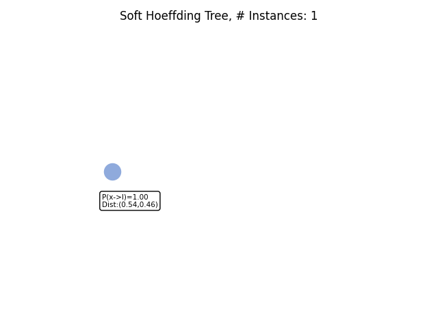

# Soft Hoeffding Tree

This repository contains a new predictive base learner Soft Hoeffding Tree (SoHoT) for large and drifting data streams.
A SoHoT combines the extensibility and transparency of Hoeffding trees with the differentiability of soft trees.
A new gating function is used to regulate the balance between transparent and soft routing in a SoHoT, 
which is essentially a trade-off between transparency and performance. 
SoHoT can be used in a neural network due to its differentiability.


## Example Code
```python
from benchmark.load_data import load_data_stream
from sohot.sohot_ensemble_layer import SoftHoeffdingTreeLayer
from capymoa.evaluation import ClassificationEvaluator


data_stream, n_instances = load_data_stream('AGR_small')
model = SoftHoeffdingTreeLayer(schema=data_stream.get_schema(), trees_num=1)
evaluator = ClassificationEvaluator(schema=data_stream.get_schema())
for i in range(n_instances):
    instance = data_stream.next_instance()
    y_pred = model.predict(instance)
    evaluator.update(y_target_index=instance.y_index, y_pred_index=y_pred)
    model.train(instance)
    if i == 5000:
        model.plot_tree(instance=instance, tree_idx=0)
print(f"Accuracy: {evaluator.accuracy()}")
```

## Transparency
Soft Hoeffding tree evolving over the data stream generated with Agrawal generator containing three abrupt drifts (applying the classification functions: 2, 3, 5, 6).
